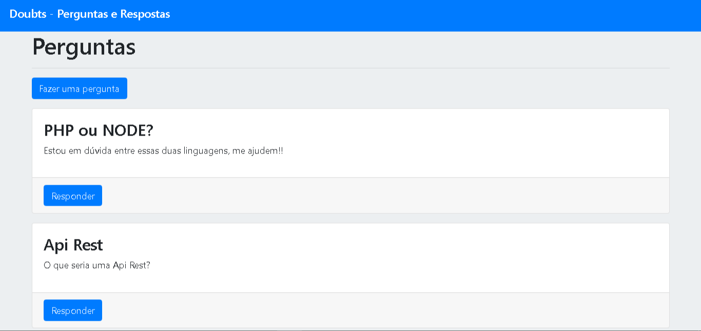

# 💻 Preview

<h1>
    
</h1>

## 📌 Sobre

**Doubts** é uma aplicação web de perguntas e respostas que foi criada dentro do curso **formação Node.js** para colocar em prática o que tinhamos estudado até o momento.

---

## 🚀 Técnologias utilizadas

O projeto foi desenvolvido usando as seguintes técnologias:

- [Node.js](https://nodejs.org)
- [Mysql](https://mysql.com)
- [Ejs](https://ejs.co)
- [Sequelize](https://sequelize.org)

---

## ⌨ Como baixar o projeto

```bash

    # Clonar repositório
    $ git clone https://github.com/Rian-dpf/Doubts

    # Entrar no diretório
    $ cd Doubts

    # Intalar as dependências
    $ yarn install

    # Iniciar o projeto
    $ yarn start
```
